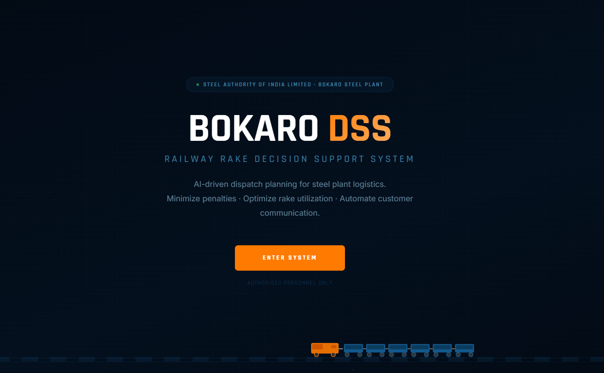
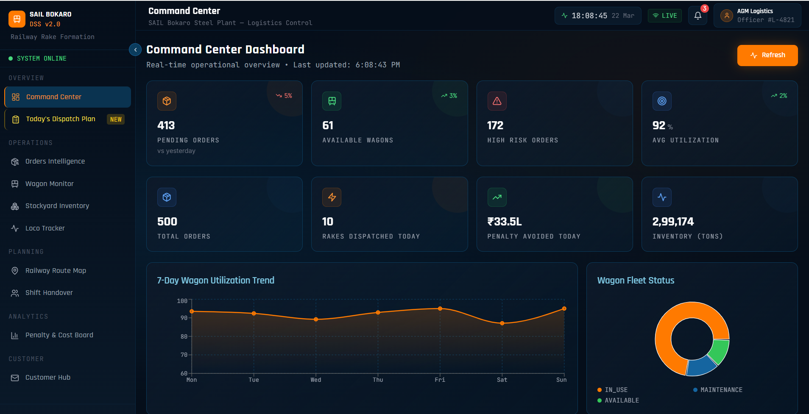
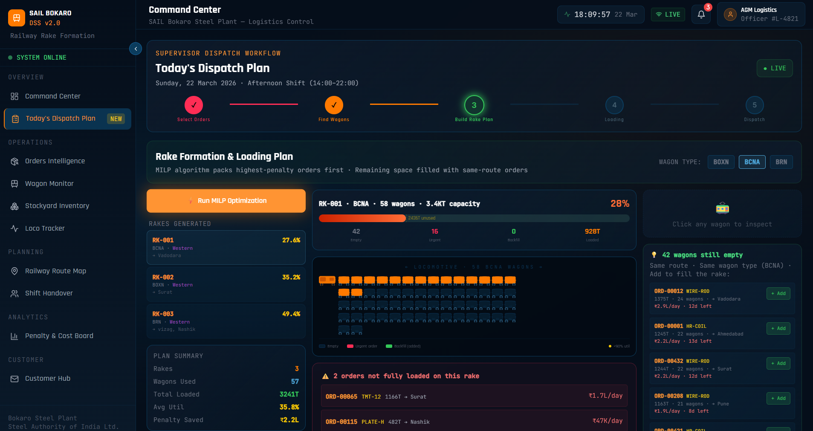

# 🚂 SAIL Bokaro Steel Plant — AI-Assisted Railway Rake Formation DSS

🔗 *Live Demo: (add after deployment)*

---

## 🏭 Project Overview

This project presents an **industry-inspired, production-style Decision Support System (DSS)** for optimizing railway rake formation and dispatch planning in steel plants like SAIL Bokaro.

Railway dispatch planning is a **constraint-heavy operational problem**, involving wagon compatibility, deadlines, penalty risks, and corridor alignment. Manual planning often leads to inefficient utilization and delayed decisions.

This system introduces an **AI-assisted optimization framework using Greedy heuristics and MILP (PuLP/CBC)** to support fast, scalable, and intelligent decision-making.

---

## 🎯 Industrial Use Case

Steel plants dispatch products such as Hot Rolled Coils, Plates, and Billets via railway wagons. Logistics planners must:

* Identify available wagons
* Match products with compatible wagon types
* Form optimal rakes under strict constraints
* Prioritize high-urgency, high-penalty orders
* Maximize wagon utilization

This system enhances the **decision-making process** while keeping control with human planners.

---

## 🏗️ Architecture

```
Frontend (React + Vite + Tailwind)
        ↓
Backend (FastAPI)
        ↓
Optimization Engine
(Greedy Heuristic + MILP)
        ↓
Data Layer (Orders, Wagons, Routes)
```

---

## 🔧 Tech Stack

| Layer               | Technology                         |
| ------------------- | ---------------------------------- |
| Frontend            | React, Vite, Tailwind CSS          |
| Backend             | FastAPI (Python)                   |
| Optimization        | Greedy Heuristic + MILP (PuLP/CBC) |
| Data Processing     | Pandas, NumPy                      |
| API Communication   | Axios                              |
| Visualization       | Recharts                           |
| Document Generation | ReportLab                          |

---

## 📊 Dataset Description

Synthetic datasets modeled on real-world steel logistics include:

* Orders (product, quantity, deadline, penalty)
* Wagon inventory (type, capacity, availability)
* Product–wagon compatibility
* Railway routes and destinations

---

## 🤖 Optimization Approach

### Phase 1 — Greedy Priority Selection

Orders are ranked using:

```
urgency = penalty_per_day / deadline_days
```

* Higher urgency orders prioritized
* Grouping by wagon compatibility and corridor

---

### Phase 2 — MILP Optimization (PuLP/CBC)

* Maximizes capacity utilization
* Minimizes penalty exposure
* Ensures:

  * Homogeneous wagon types per rake
  * Constraint satisfaction

---

## 📊 Key Features

* 🚂 Automated Rake Formation
* 📈 Penalty-Aware Prioritization
* 📊 Interactive Decision Dashboard
* 🔄 Workflow Automation
* 📧 Dispatch Communication Support
* 📦 Constraint-Aware Allocation

---

## 📈 Results (Simulated)

* ~20% improvement in rake utilization
* ~25–35% reduction in penalty exposure
* Faster planning compared to manual methods

---

## 📸 Screenshots


### Intro :



### Dashboard



### Todays Plan:


---

## 🚀 Getting Started

### Prerequisites

* Python 3.11+
* Node.js 18+

---

### Backend Setup

```
cd backend
python -m venv venv
venv\Scripts\activate
pip install -r requirements.txt
uvicorn main:app --reload
```

---

### Frontend Setup

```
cd frontend
npm install
npm run dev
```

---

## 🔐 Configuration

Create `.env` file in backend:

```
GMAIL_USER=your-email@gmail.com
GMAIL_APP_PASSWORD=your-app-password
```

---

## 🔬 Research Contribution

* Real-world modeling of rake formation problem
* Hybrid Greedy + MILP optimization approach
* Penalty-aware scheduling strategy
* Scalable DSS architecture for logistics

---

## ⚠️ Note

This project uses **synthetic datasets modeled on real-world logistics patterns** and is intended for research and prototyping purposes.


---

## 🤝 Acknowledgment

Inspired by logistics challenges in large-scale steel plants such as SAIL Industries.
